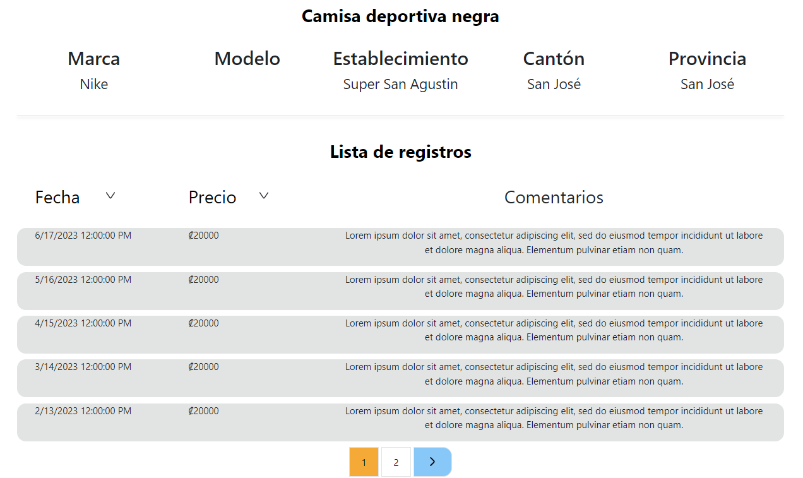

# Database Drafts

WebApp que permite encontrar el mejor precio en un establecimiento cercano de un producto buscado.


## Integrantes

- [Dwayne Taylor | C17827](https://github.com/Dwayne-T)
- [Alonso León | B94247](https://github.com/Alr201)
- [Omar Camacho | C11476](https://github.com/OmArCaMc)
- [Julio Alejandro | C16717](https://github.com/JulioAleRodri)
- [Geancarlo Rivera | C06516](https://github.com/JGeanca)

## Información adicional
**Curso:**
- CI-0128 Proyecto Integrador de Ingeniería de Software y Bases de Datos

**Profesores:**
- Dr. Allan Berrocal Rojas
- Dra. Alexandra Martínez

### LoCoMPro

En la empresa, **_Buen Software S.A._**, se han planteado desarrollar una aplicación que
permita a sus usuarios gestionar el proceso de Localización y Consulta del Mejor
Producto, le han llamado **LoCoMPro**. Esta sería una aplicación de software que
permita a las personas colaborar generando información sobre precios de productos, y
al mismo tiempo beneficiarse de esta información para sus propias compras.

## Estructura de archivos
```plaintext
+---data
+---design
|   \---sprint0
|       +---database
|       |   +---avance1
|       |   \---avance2
|       \---mockups
|           +---avance1
|           \---avance2
|   \---sprint1
|      +---mockups
|          +---avance1
|      \---uml
|          +---avance2
|      \---database
|          +---avance2
+---source
|   \---LoCoMPro
|       \---LoCoMPro
|           +---Areas
|           |   \---Identity
|           |       \---Pages
|           |           \---Account
|           |               \---Manage
|           +---Data
|           +---Models
|           +---Pages
|           |   \---Shared
|           +---Properties
|           +---Utils
|           \---wwwroot
|               +---css
|               +---img
|               +---js
|               \---lib
|   \---doc
|       +---docgen
\---test
    \---UnitTest
```

- El directorio ["./data/"](./data) contiene información importante para generar los datos para la base de datos
- El directorio ["./design/"](./design/) contiene los archivos de diseño
- El directorio ["./design/sprint1/avance1/database/"](./design/sprint1/database/avance2/) contiene los diagramas de la base de datos
- El directorio ["./design/sprint1/avance2/mockups/"](./design/sprint1/mockups/avance1/) contiene los mockups de las páginas implemetadas durante el sprint
- El directorio ["./design/sprint1/avance2/uml/"](./design/sprint1/uml/avance2/) contiene los diagramas del modelo del sistema
- El directorio ["./source/"](./source/) contiene el código e archivos importantes
- El directorio ["./source/LoCoMPro/LoCoMPro/"](./source/LoCoMPro/LoCoMPro/) contiene los archivos con el código del sistema
- El directorio ["./test/"](./test/) contiene los test unitarios del proyecto

# Manual de usuario 

## LoCoMpro

LoCoMProp es una aplicación que apunta a la cooperación entre los usuarios para proveer información precisa sobre los precios y ubicación de productos.

## Descripción

El software es un sistema que integra un motor de búsqueda para permitir a los usuarios buscar y descubrir productos de su interes, además de proveer la capacidad de calificar reseñas subidas por otros usuarios sobre un producto que se encuentra en un establecimiento específico.

## Información de acceso

El sistema web LoCoMPro permite a los usuarios iniciar sesión y registarse en la aplicación por medio de su correo eléctronico y una contraseña. Los usuarios que no poseen una cuenta de LoCoMPro, puede crear una al registrase por medio de su correo eletrónico, su nombre de usuario y una contraseña. Estas credenciales deben seguir ciertas reglas para para ser consideradas válidas por el sistema, como no sobrepasar cierto límite de caractéres, poseer letras en mayúscula y minúscula o contar con números y caractéres especiales, además de que no pueden existir dos correos y nombres de usuarios iguales en el sistema.

Lo usuario que poseen una cuenta de LoCoMPro pueden iniciar sesión utilizando el mismo correo y contraseña que ingresaron al momento de registrarse. Una vez se inicio sesión, el usuario tiene la opción de cerrar sesión en caso de que ya no desee ser identificado por su cuenta.

Todos lo usuario de la aplicación pueden utilizar el motor de búsqueda para realizar búsquedas de productos y también pueden pueden ingresar a la página que muestra los registros de un producto en una tienda en específico. Un usuario que no haya iniciado sesión no puede agregar nuevos registros en el sistema ni tampoco puede interactuar con los registros subidos por otros usuarios, para ello debe iniciar sesión, o en el caso de no poseer una cuenta, registrase.

Para registrar un nuevo usuario se debe tener en cuenta las siguientes restricciones:

**Correo**
- Debe contar con el formato estandar de un correo electrónico
- Contar con el símbolo "@" y un dominio válido, por ejemplo "@gmail.com" o "ucr.ac.cr"
- Contar con TLD
- No se puede utilizar un correo que haya sido ingresado para otra cuenta

**Usuario**
- No sobrepasar el límite de caractéres
- Puede contar con mayúsculas, minúsculas, números, espacios y cierta lista de caractéres adicionales
- No puede componerse de solamente espacios en blanco
- No se puede utilizar un nombre de usuario que haya sido ingresado para otra cuenta

**Contraseña**
- Debe de contar con al menos 6 caracteres
- Debe contar con al menos una letra mayúscula
- Debe contar con al menos una letra minúscula
- Contar con al menos un número
- Contar con al menos un signo de puntuación
- No puede estar compuesta completamente de espacios en blanco

## Uso de las funcionalidades de la aplicación

La aplicación LoCoMPro busca brindar un entorno fácil de utilizar, intuitivo y confiable para realizar búsqueda de productos, además basarse en los aportes realizados por los usuarios del sistema para brindar información verídica. Sumado a lo anterior, posee funcionalidades que facilitan y extienden las ya mencionadas, con el proposito de brindar mayor control y poder a los usuario al momento e utilizar el sistema.

### Registrarse

El sistema permite a los usuario que no cuentan con una cuenta de LoCoMPro registrarse ingresando un correo electrónico, un nombre de usuario y una contraseña.


### Iniciar sesión

Permite a los usuario que ya poseen una cuenta ingresar y ser identificados por el sistema al ingresar el correo y contraseña utilizada para crear la cuenta.


### Buscar un producto

El motor de búsqueda de LoCoMPro permite a los usuarios buscar productos que fueron ingresados por otros usuario por medio de una barra de búsqueda. El puede buscar por medio del nombre, la marca o el modelo del producto y se le mostrarán los resultados de dicha búsqueda que coincidan con los datos que se encuentran en el sistema.


### Visualizar un producto

La aplicación permite al usuario ver los datos de un producto específico que se encuentra en un establecimiento en específico, además de observar los registros ingresados por otros usuarios.



### Agregar registro

Se le permite a los usuario que se encuentre registrados agregar nuevos registros de un producto específico en un establecimiento en específico, añadiendo información importante que pueda ser visualizada por otros usuarios.


### Ordenar resultados

Al realizar una búsqueda o visualizar los registros de un producto, es posible elegir el orden de los registros que se muestran según diversos atributos.


### Filtrar resultados

Al realizar una búsqueda, es posible filtrar los resultados obtenidos según diversos stributos para limitar los resultados obtenidos.


### Elegir ubicación

El sistema LoCoMPro permite a los usuario elegir una ubicación que va a ser tomada como referencia al momento de realizar búsquedas.


### Autocompletado

Al momento de agregar un nuevo registro de un producto, el sistema puede recomendar al usuario establecimiento y productos ya existentes en los datos de la aplicación. Sumado a lo anterior, dado que se use el autocompletado, el sistema llenará la información de la categoría, marca y modelo del producto de manera automática.


# Manual Técnico
## Prerequisitos

Para la correcta ejecución del programa se requiere:
- Microsoft Visual Studio 2022 versión Community.
- Dependencias de ASP.NET instaladas en Visual Studio.
- Aplicación para conectarse al VPN de la ECCI, en este caso se está utilizando Pritunl.

## Instalación

Para comenzar con la instalación y los paquetes, primero descargue el instalador de Visual Studio 2022 versión Community dirijiéndose al siguiente link: [Descargar Visual Studio 2022]
(https://visualstudio.microsoft.com/es/downloads/). Saldrán varias opciones de descarga, se recomienda elegir la versión "Comunidad".

Una vez descargado el instalador, ejecútelo y en el primer diálogo presione "Continuar", con esto Visual Studio comenzará a descargarse e instalarse automáticamente en su computadora como se observa en la siguiente imagen:


Una vez completada la descargada e instalación se deben instalar las dependencias ASP.NET, para esto seleccione la versión de Visual Studio que recien instaló y haga clic en el botón "modify" como se muestra en la siguiente imagen:


Luego en la ventana emergente seleccione las casillas de ASP.NET and web development y Azure development y seleccione "Install" y espere a que se instalen:


## Preparación de la base de datos
La aplicación requiere de una base de datos para almacenar toda su información, para esto se pueden seguir dos métodos: utilizar una base de datos local instalada en una computadora propia o utilizar la base de datos proporcionada por la ECCI.

### Utilizar una base de datos local
Para utilizar una base de datos local se debe instalar SQL Server Expresss en el siguiente link: [Descargar SQL Server Express] (https://www.microsoft.com/en-us/sql-server/sql-server-downloads). Una vez instalado también es recomendable instalar SQL Server  Management Studio, que le permite administrar el servidor de bases de datos de forma visual. El enlace para descargarlo es el siguiente: [SQL Server Management Studio] (https://learn.microsoft.com/en-us/sql/ssms/download-sql-server-management-studio-ssms?view=sql-server-ver16#download-ssms).

Para configurar la aplicación para que utilice la base de datos local es necesario editar el archivo `appsettings.json` para que el ConectionStrings contenga algo parecido a lo siguiente siguiente: 
```
"ConnectionStrings": {
  "LoCoMProContext": "Server=(localdb)\\mssqllocaldb;Database=LoCoMProContext;Trusted_Connection=True;MultipleActiveResultSets=true"
}
```

### Utilizar la base de datos de la ECCI
Para utilizar la base de datos proporcionada por la ECCI, primero hay que conectarse a la red de la escuela mediante un VPN Client. En este caso en específico se va a utilizar Pritunl, el cual se puede descargar mediante el siguiente link: [Pritunl Client] (https://client.pritunl.com/#install). A continuación siga el siguiente enlace para obtener una descripción detallada de cómo conectarse a la VPN de la ECCI: [VPN ECCI] (https://wiki.ecci.ucr.ac.cr/estudiantes/vpn).

Para configurar la aplicación para trabaje con la base de datos proporcionada por la escuela modifique el campo de ConectionStrings en `appsettings.json` para que contenga lo siguiente:
```
"ConnectionStrings": {
  "LoCoMProContext": "Server=172.16.202.209;Database=Equipo1;User Id=Equipo1Admin;Password=ZwMcPuQjo37641.;Trusted_Connection=False;TrustServerCertificate=True;"
}
```

## Ejecución de la Aplicación
Una vez teniendo todos los prerequisitos de instalación, ejecute Visual Studio, continuando con los pasos anteriores puede hacerlo presionando el botón "Launch":


Una vez abierto Visual Studio, vamos a descargar el proyecto LoCoMPro desde el repositorio de GitHub, para esto, en la primera ventana que se muestra al abrir Visual seleccione la opción "Clone a repository" como se observa en la siguiente imagen:


Seleccione el path o ubicación en su computadora donde desea que se guarde el proyecto, luego en la caja "Repository location" copie y pegue el siguiente enlace que corresponde al repositorio del proyecto: https://github.com/Alr201/ci0128_23b_database_drafts.git, por último presione el botón "Clone", puede ver este proceso en la siguiente imagen:


Con esto, ya tendrá el proyecto en la ubicación seleccionada en el paso anterior, ahora para abrirlo en Visual Studio, vaya al "Solution Explorer" y en la ubicación: `source/LoCoMPro` y de doble click al archivo llamado `LoCoMPro.sln`. Este proceso se muestra en la siguiente imagen:


*Nota*: En caso de que no visualice el "Solution Explorer" de Visual Studio, puede abrirlo en la barra de opciones, en la sección de View y presionando "Solution Explorer" o  presionando la combinación de teclas Ctrl+Alt+l en su teclado.


Como último paso simplemente ejecute la aplicación dando click al botón de la flecha verde como se muestra en la siguiente imagen: 


Si aplicó todos estos pasos, entonces se abrirá en su navegador la aplicación y ya podrá comenzar a interactuar con ella:


*Nota*: Puede elegir el navegador de su preferencia en el que quiere que se abra la aplicación dando click en el desplegable que se encuentra ubicado a la derecha de la flecha verde con la que ejecuta el programa.


## Ejecutar Tests
Para ejecutar los tests de la aplicación abra el proyecto en Visual Studio y en la barra de opciones, en la sección Test seleccione Test Explorer como se muestra en la siguiente imagen:


El paso anterior abrirá una ventana emergente donde puede ver el detalle de los tests disponibles, para ejecutarlos simplemente presione el botón de la flecha verde como se muestra en la siguiente imagen:


Una vez ejecutado los tests, podrá ver y explorar los resultados de cada uno, la siguiente imagen muestra el caso en el que todos los tests disponibles pasaron satisfactoriamente:


